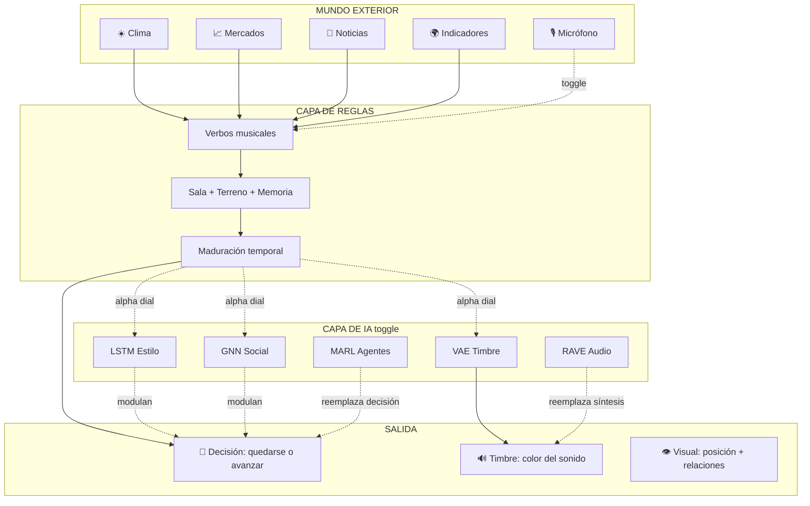

# Panel de Expertos: IA en In C / Mundo Real

> Tres voces. Cinco rondas. Sin código. Solo pensamiento.

---

## Los panelistas

| | Nombre | Perspectiva | Pregunta que lo guía |
|---|---|---|---|
| 🎨 | **Lila** — Compositora y artista sonoro | Arte + Estética | *¿Qué gana la obra y qué pierde?* |
| 🔬 | **Tomás** — Neurocientífico computacional | Ciencia + Cognición | *¿Qué modelo captura mejor la emergencia?* |
| ⚙️ | **Nuria** — Ingeniera de sistemas inteligentes | Tecnología + Arquitectura | *¿Qué se puede correr en un navegador y qué no?* |

---

## Ronda 1: ¿Qué tiene hoy el sistema y qué le falta?

**🎨 Lila:**
Lo primero que hay que reconocer es que este sistema *ya* tiene inteligencia. No artificial, pero sí algorítmica. Cada músico virtual tiene un modelo de decisión con diez variables ponderadas, memoria de dos capas, una compuerta temporal y una decisión probabilística. Eso no es trivial. Es un sistema de reglas expertas con ruido estocástico.

Pero hay algo que le falta: **aprendizaje**. Los músicos no cambian su comportamiento a lo largo de la obra. El músico del patrón 1 toma decisiones con la misma lógica que el del patrón 50. No hay acumulación de experiencia. No hay "personalidad emergente". Las reglas son estáticas; lo que varía es el contexto.

**🔬 Tomás:**
Exacto. Y eso es interesante porque en la neurociencia de la improvisación musical, lo que diferencia a un músico experto de uno novato no es que tenga "mejores reglas", sino que tiene **representaciones internas** del estado del ensamble que se actualizan continuamente. Un músico de jazz que lleva 20 minutos tocando con un trío *ya no es el mismo agente* que al principio: su modelo interno del estilo de sus compañeros se ha refinado.

Hoy, el sistema tiene algo parecido con la "memoria larga" y el "terreno", pero son contadores lineales. No hay representación comprimida del *estilo* de los otros músicos.

**⚙️ Nuria:**
Desde la implementación, lo que veo es un sistema reactivo con estado. Es elegante, corre en el navegador, no necesita servidor. La pregunta clave es: si metemos IA, ¿rompemos esa propiedad? Porque un modelo de deep learning pesado necesita GPU, backend, latencia. Y esta obra es *tiempo real musical* — hablamos de decisiones cada ~2 segundos.

Pero hay modelos livianos que podrían correr en el browser con TensorFlow.js o ONNX Runtime Web. La pregunta no es "¿qué modelo es el mejor?" sino **"¿qué modelo es el más expresivo que quepa en un navegador?"**

---

## Ronda 2: Cinco familias de modelos y qué harían acá

**🔬 Tomás:**
Voy a plantear cinco candidatos concretos. Ninguno es un LLM. Todos tienen implementaciones ligeras.

### Modelo 1: Reinforcement Learning Multiagente (MARL)

Cada músico sería un **agente RL** cuya recompensa no es "tocar bien" sino *mantener la convivencia*. El estado es su posición, la de los otros, el terreno, la memoria. La acción es binaria: quedarse o avanzar.

Lo poderoso: los agentes podrían **aprender políticas diferentes entre sí** a partir de la misma función de recompensa. Uno podría volverse conservador, otro explorador. No porque se lo programemos, sino porque la dinámica multiagente produce eso naturalmente.

El problema: entrenar MARL es inestable, necesita miles de episodios, y la recompensa es difícil de definir. ¿Qué es "buena convivencia"? ¿Cómo la mido sin juicio estético?

**🎨 Lila:**
Y ahí está la tensión fundamental. Si definís la recompensa como "minimizar la distancia entre músicos", obtenés un sistema que converge a unísono permanente. Si la definís como "maximizar diversidad de posiciones", se dispersan. La recompensa *es* la estética, y la estética es lo que no sabemos formalizar.

Yo propondría algo más sutil: la recompensa podría ser **la sorpresa mutua**. Usar la entropía cruzada entre las predicciones que un agente hace sobre los otros y lo que realmente sucede. Un ensamble interesante es aquel donde los músicos se sorprenden mutuamente *pero no demasiado*.

**⚙️ Nuria:**
Técnicamente, un agente RL con una red pequeña (2 capas, 64 neuronas) podría correr en el browser. El tema es el entrenamiento. Opciones:
- **Pre-entrenar offline** con simulaciones aceleradas y cargar los pesos.
- **Entrenar online** durante la obra (arranca torpe, mejora con el tiempo).

La segunda opción es más artística pero más riesgosa. Podríamos hacer un toggle: *"IA: OFF"* usa las reglas actuales, *"IA: ON"* activa los agentes RL con pesos pre-entrenados que se afinan en vivo.

---

### Modelo 2: Redes Recurrentes (LSTM / GRU) para Memoria Musical

**🔬 Tomás:**
Hoy la memoria del sistema son dos arrays de floats (terreno y memoriaLarga) que decaen linealmente. Eso es una memoria *sin estructura*. No distingue "el patrón 12 fue tocado mucho hace 3 minutos" de "el patrón 12 fue tocado poco pero justo ahora".

Una LSTM pequeña podría recibir como input la secuencia temporal de (posición, estado, verbos) de cada músico y producir una **representación comprimida** del "estilo reciente" de ese intérprete. Esa representación es un vector denso de, digamos, 16 dimensiones que captura algo que las reglas manuales no pueden: el *patrón temporal* de comportamiento.

**🎨 Lila:**
Esto me interesa mucho. Porque lo que describe Tomás es lo que en música llamamos **fraseo**: no es qué notas tocás, es *cómo las distribuís en el tiempo*. Un músico que avanza cada 40 segundos tiene un fraseo distinto de uno que avanza cada 90. Hoy eso no se captura.

Si la LSTM produce un vector de "personalidad temporal" y ese vector alimenta la decisión de los *otros* músicos, entonces cada uno estaría literalmente **escuchando el estilo del otro**, no solo su posición.

**⚙️ Nuria:**
Una LSTM de 32 unidades con secuencias de 20 pasos corre sin problema en TensorFlow.js. Podría actualizarse en cada ciclo (cada ~2s). El costo computacional es despreciable comparado con la síntesis de audio que ya corre en Tone.js.

Lo que necesitamos definir es: ¿la LSTM se entrena offline con simulaciones, o se entrena online? Para el caso de "capturar el estilo", online tiene más sentido: arranca sin memoria y la va construyendo durante la obra. Eso es hermoso conceptualmente: **el sistema empieza sin conocerse y termina conociéndose**.

---

### Modelo 3: Variational Autoencoder (VAE) para Espacio Latente de Timbre

**🎨 Lila:**
Acá quiero proponer algo que sale del terreno de las decisiones y entra en el del *sonido*. Hoy los presets son fijos: Vocoder, Campana, Rhodes. El usuario puede elegir, pero el timbre no cambia durante la obra en función de lo que pasa.

¿Qué pasaría si los parámetros de síntesis (tipo de oscilador, armónicos, envolvente, modulación) vivieran en un **espacio latente continuo** generado por un VAE? En vez de saltar de "Vocoder" a "Space Lady", el músico podría *deslizarse* por un continuo de timbres, y su posición en ese espacio dependería de su estado emocional/contextual.

**🔬 Tomás:**
Brillante. Un VAE entrenado sobre un corpus de parámetros de síntesis FM/AM produce un espacio 2D o 3D donde cada punto es un timbre válido. Los ejes del espacio latente capturan dimensiones perceptuales (brillante↔oscuro, percusivo↔sostenido, armónico↔inarmónico).

Entonces el estado del músico (posición, verbos, memoria) se mapea a un punto en ese espacio, y el sintetizador usa esos parámetros en tiempo real. **El timbre se vuelve una función continua del contexto**, no una elección discreta.

**⚙️ Nuria:**
El decoder de un VAE pequeño (3 capas, espacio latente de 4 dimensiones) produce parámetros de síntesis en microsegundos. La parte pesada es el entrenamiento, pero eso se hace una vez offline.

Lo que me gusta es que esto es **completamente prendible/apagable**:
- *OFF*: presets fijos como ahora.
- *ON*: el timbre muta continuamente en función del estado.

Y el usuario podría ver una visualización del espacio latente en la UI: un punto moviéndose por un mapa de timbres.

---

### Modelo 4: Graph Neural Network (GNN) para Dinámica Social

**🔬 Tomás:**
Hoy la "escucha entre músicos" es una función manual: distancia, unísono, quién avanzó. Pero la estructura real es un **grafo dinámico**: tres nodos conectados con aristas que tienen peso variable (distancia, correlación de movimientos, influencia reciente).

Una GNN pequeña podría tomar ese grafo como input y producir, para cada nodo, una señal de "presión social" más rica que la suma manual de contribuciones. Las GNNs capturan naturalmente fenómenos como:
- **Influencia transitiva**: A influye en B, B influye en C, por lo tanto A influye indirectamente en C.
- **Roles emergentes**: líder, seguidor, puente.
- **Clusters**: dos músicos "aliados" vs. uno "independiente".

**🎨 Lila:**
Esto tiene una belleza conceptual enorme. En un ensamble de cámara real, los músicos no solo se escuchan en pares: hay alianzas, tensiones triangulares, roles que rotan. Hoy el sistema simula esto con reglas, pero una GNN lo *descubriría* a partir de la dinámica real.

Mi preocupación: ¿no perdemos interpretabilidad? Hoy puedo abrir el breakdown y ver "cohesión: 0.12, separación: 0.08, impacto: 0.15". Si una GNN produce un vector opaco, ¿cómo le explico al público qué está pasando?

**⚙️ Nuria:**
Con tres nodos, la GNN es trivial computacionalmente. Podría correr 100 veces por segundo sin impacto. La interpretabilidad se resuelve con **attention weights**: qué arista del grafo pesó más en la decisión. Eso se puede visualizar directamente en la vista circular: líneas más gruesas entre músicos que se están escuchando más.

---

### Modelo 5: Modelos de Difusión para Síntesis de Audio

**🎨 Lila:**
Esto es lo más radical. Hoy usamos Tone.js: síntesis clásica (FM, AM, sustractiva). Los timbres son reconocibles, limpios, predecibles. ¿Qué pasaría si en lugar de sintetizar con osciladores, usáramos un **modelo de difusión de audio** que genera el sonido nota por nota?

Existen modelos como AudioLDM y Stable Audio que generan clips de audio a partir de descripciones. Imaginate que el estado del músico ("patrón 23, estado desbordado, memoria saturada, viento fuerte en Buenos Aires") se traduce en un prompt latente que genera un timbre único, irrepetible, para *esa* nota en *ese* momento.

**🔬 Tomás:**
Es fascinante pero hay que ser honestos: los modelos de difusión de audio son enormes (cientos de MB), lentos (segundos por generación), y necesitan GPU. No corren en un navegador en tiempo real hoy.

Pero hay un camino intermedio: **RAVE** (Real-time Audio Variational autoEncoder). Es un modelo que sí corre en tiempo real, pesa ~5MB, y puede correr en el navegador con ONNX. Permite transformar audio en un espacio latente y reconstruirlo con variaciones. Podrías alimentarlo con los patrones de In C pre-grabados y dejar que el estado del sistema *deforme* la reconstrucción.

**⚙️ Nuria:**
RAVE es la opción realista. Se entrena offline con un corpus (por ejemplo, grabaciones de instrumentos acústicos tocando los 53 patrones), y en runtime el decoder corre en Web Audio Worklet. El input al decoder es el vector latente, que podemos modular con las señales del sistema.

El toggle aquí sería:
- *OFF*: síntesis Tone.js clásica.
- *ON*: síntesis RAVE con timbres vivos y mutantes.

> [!IMPORTANT]
> RAVE es probablemente el modelo más transformador para esta obra: convertiría los sonidos de "sintetizador digital" en texturas orgánicas, vivas, que respiran con el contexto.

---

## Ronda 3: La pregunta estética — ¿Qué se pierde?

**🎨 Lila:**
Quiero frenar un momento porque llevamos cinco modelos brillantes y no hemos hablado de lo que se puede perder.

La obra tiene hoy una cualidad que me importa mucho: **legibilidad**. Puedo abrir el panel, ver los verbos, entender por qué un músico avanzó. Puedo leer el breakdown: "cohesión 0.12, momentum 0.08, la señal del clima empujó". Eso es raro y valioso. La mayoría de las obras generativas son cajas negras.

Si metemos una GNN o un agente RL, ¿perdemos eso? ¿Se vuelve "la IA decidió avanzar" sin poder decir por qué?

**🔬 Tomás:**
Es una preocupación válida pero tiene solución. Lo que propongo es una **arquitectura híbrida**:

```
┌─────────────────────────────────────────────┐
│         CAPA DE REGLAS (existente)           │
│  verbos + cohesión + terreno + memoria      │
│  → produce puntaje legible con breakdown    │
├─────────────────────────────────────────────┤
│         CAPA DE IA (opcional, toggle)       │
│  LSTM → estilo temporal                     │
│  GNN  → presión social refinada             │
│  VAE  → espacio de timbre                   │
│  → produce MODULACIÓN del puntaje           │
├─────────────────────────────────────────────┤
│         DECISIÓN FINAL                      │
│  p = reglas × modulación_IA                 │
│  → breakdown muestra AMBAS contribuciones   │
└─────────────────────────────────────────────┘
```

La IA no *reemplaza* las reglas: las **modula**. El breakdown sigue mostrando las 10 contribuciones originales, pero agrega: "modulación IA: ×1.3 (el estilo reciente de Percusión sugiere que va a avanzar pronto y conviene esperar)".

**⚙️ Nuria:**
Eso es implementable. La capa de IA corre en paralelo y produce un multiplicador entre 0.5 y 1.5. Si el toggle está en OFF, el multiplicador es 1.0 y todo funciona como hoy. Si está en ON, la IA puede amplificar o atenuar la probabilidad base.

Y la UI puede mostrar esa modulación con un indicador visual simple: un halo alrededor del músico en la vista circular que cambia de color cuando la IA está actuando.

---

## Ronda 4: ¿Qué modelo elegimos primero?

**🎨 Lila:**
Si tengo que elegir *uno* para empezar, elijo el **VAE de timbre**. Razones:

1. No toca la lógica de decisión (no hay riesgo de romper la convivencia).
2. Es prendible/apagable sin consecuencias.
3. El impacto es inmediatamente perceptible: *suena diferente*.
4. Es visualmente representable (un punto en un mapa 2D).
5. Conecta los datos del mundo real con algo que el oyente percibe directamente: el color del sonido.

Hoy, si hay un viento fuerte en Buenos Aires, eso cambia la *probabilidad* de avanzar. Pero el oyente no lo escucha. Con un VAE de timbre, ese viento podría hacer que el instrumento suene más áspero, más abierto. **El dato se vuelve audible**, no solo computable.

**🔬 Tomás:**
Coincido en que el VAE es el más seguro para empezar. Pero el que tiene más potencial transformador es la **LSTM de estilo temporal**. Porque resuelve el problema más profundo del sistema: hoy los músicos no se conocen entre sí.

Mi propuesta de roadmap:

| Fase | Modelo | Impacto | Riesgo |
|------|--------|---------|--------|
| 1 | **VAE de timbre** | El sonido muta con el contexto | Bajo |
| 2 | **LSTM de estilo** | Los músicos se "conocen" | Medio |
| 3 | **GNN social** | Roles emergentes (líder/seguidor) | Medio |
| 4 | **RAVE audio** | Síntesis orgánica | Alto (técnico) |
| 5 | **MARL** | Autonomía total | Alto (estético) |

**⚙️ Nuria:**
Desde lo técnico agrego:

- **Fase 1 (VAE)**: Entrenable en una tarde con datos sintéticos. ~50KB de pesos. Corre en el browser sin problema.
- **Fase 2 (LSTM)**: Entrenamiento online durante la obra. ~100KB. Browser-friendly.
- **Fase 3 (GNN)**: Con 3 nodos es casi un juguete computacional. ~30KB.
- **Fase 4 (RAVE)**: Necesita corpus de audio para entrenar. ~5MB de pesos. Corre en AudioWorklet.
- **Fase 5 (MARL)**: El más complejo. Necesita definir la función de recompensa (problema abierto). Pre-entrenamiento offline obligatorio.

---

## Ronda 5: El toggle — Filosofía del encendido/apagado

**🎨 Lila:**
El toggle es lo que hace que esto sea una obra y no un paper. 

Cuando el usuario prende la IA, no debería ser como prender una luz. Debería ser como **invitar a un cuarto músico invisible**. Alguien que no toca, pero que susurra sugerencias. Que observa patrones que los otros tres no ven. Que tiene una memoria más profunda y una percepción más sutil de las relaciones.

Y cuando se apaga, ese cuarto músico se va. Los tres quedan solos con sus reglas. Y el oyente debería poder notar la diferencia: no porque "suena peor" sino porque *la dinámica cambia*. Con IA, los músicos se sorprenden más, mutan más, se conocen. Sin IA, son más predecibles pero también más transparentes.

**🔬 Tomás:**
Eso me lleva a una idea: el toggle no debería ser binario. Debería ser un **dial de influencia** de 0% a 100%:

- **0%**: Sistema de reglas puro (como hoy). Totalmente legible.
- **25%**: La IA sugiere suavemente. Los timbres empiezan a mutar.
- **50%**: La IA modula decisiones. Los músicos empiezan a "conocerse".
- **75%**: Roles emergentes. La GNN detecta alianzas y tensiones.
- **100%**: Autonomía máxima. Los agentes RL toman decisiones con mínima supervisión de las reglas.

Esto permite al usuario *explorar el espectro* entre determinismo interpretable y emergencia opaca. Es como un knob de **conciencia artificial**.

**⚙️ Nuria:**
Implementar eso es simplemente un coeficiente de mezcla:

```
p_final = (1 - alpha) × p_reglas + alpha × p_ia
```

Donde `alpha` es el dial. A nivel de UI, podría ser un slider en el panel principal con una etiqueta poética: *"ESCUCHA ARTIFICIAL"* o *"CUARTO MÚSICO"*.

Y cada sub-modelo se activa progresivamente:
- `alpha > 0.1` → VAE de timbre se activa
- `alpha > 0.3` → LSTM de estilo se activa  
- `alpha > 0.5` → GNN social se activa
- `alpha > 0.8` → RAVE se activa (si disponible)
- `alpha = 1.0` → MARL toma el control

**🎨 Lila:**
*"CUARTO MÚSICO"*. Me quedo con eso. Es perfecto. No es "Inteligencia Artificial" — es un músico más. Uno que no tiene instrumento pero tiene oído.

---

## Ronda 6 (bonus): ¿Y si la IA también escucha al público?

**🔬 Tomás:**
Última idea, la más salvaje. El navegador tiene acceso al micrófono. Un modelo de **clasificación de audio ambiental** (tipo YAMNet, 900KB, corre en el browser) podría escuchar el entorno real del oyente: si hay tráfico, voces, silencio, lluvia, música.

Eso cierra el círculo: el mundo real no solo entra por APIs de datos, sino por el **entorno físico del oyente**. Si estás en un café ruidoso, los músicos lo sienten. Si estás en silencio a las 3 AM, la obra respira distinto.

**🎨 Lila:**
Eso es... In C tal como Riley lo imaginó. La sala importa. La sala real. No solo la sala virtual de los tres músicos, sino la sala donde vos estás sentado escuchando. **El oyente se vuelve el cuarto dato**. Clima, mercados, noticias, y *vos*.

**⚙️ Nuria:**
YAMNet corre en TensorFlow.js. Produce 521 categorías de sonido ambiente. Se podría mapear a los mismos verbos (ENTRA, AVANZA, RETIENE, MUTA, SALE) según el tipo de sonido detectado. Toggle independiente: *"ESCUCHA AMBIENTE: ON/OFF"*.

> [!TIP]
> El sistema completo tendría tres capas de "mundo real":
> 1. **Datos remotos** (APIs): clima, mercados, noticias, indicadores.
> 2. **Datos locales** (micrófono): el ambiente del oyente.
> 3. **Datos internos** (sala virtual): la convivencia entre los tres músicos.
> 
> Y una capa de IA que observa las tres y modula todo.

---

## Síntesis final



> [!IMPORTANT]
> ### Principio rector
> La IA no reemplaza a los músicos. Los escucha mejor.  
> No compone. Modula.  
> No dirige. Sugiere.  
> Se prende. Se apaga. La obra sobrevive en ambos casos.
