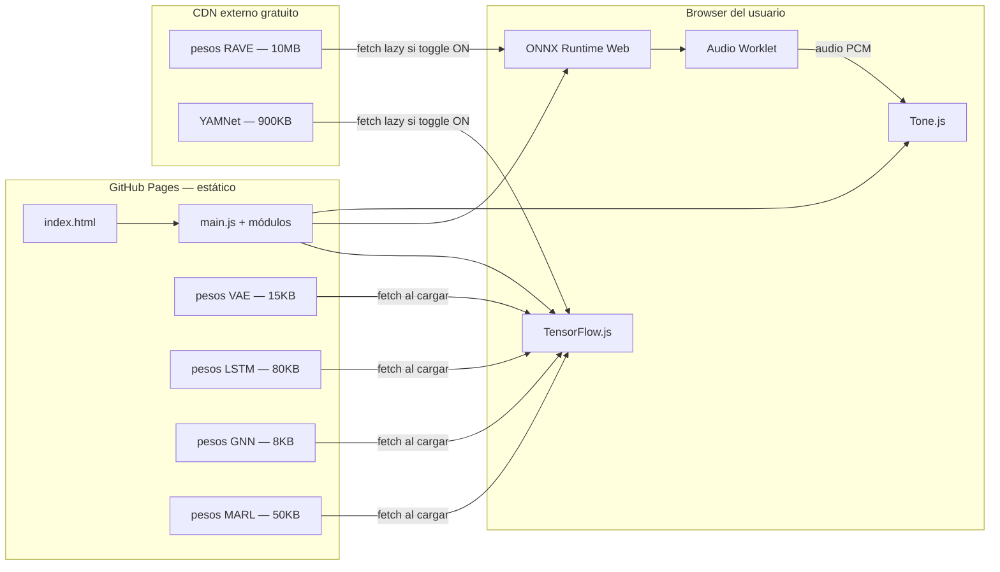

# Panel de Expertos — Parte 2: ¿Funciona en el Browser?

> Mismos tres panelistas. Ahora con los pies en la tierra.

---

## La pregunta central

**¿Podemos meter IA en In C / Mundo Real sin perder GitHub Pages, sin backend, sin GPU en la nube, sin romper nada?**

---

## Ronda 1: ¿Qué puede correr hoy en un navegador?

**⚙️ Nuria:**
Antes de hablar de modelos específicos, veamos qué motores de inferencia existen hoy para el browser:

| Motor | Qué hace | Soporte GPU | Tamaño |
|-------|----------|-------------|--------|
| **TensorFlow.js** | Corre modelos TF/Keras en JS | Sí (WebGL/WebGPU) | ~300KB core |
| **ONNX Runtime Web** | Corre cualquier modelo ONNX | Sí (WebGL/WebGPU/WASM) | ~200KB core |
| **MediaPipe** | Modelos de Google optimizados | Sí | Variable |
| **Web Audio Worklet** | Procesamiento de audio en hilo aparte | No (CPU puro) | Nativo |
| **WebAssembly (WASM)** | Código compilado casi-nativo | No | Depende |

Lo importante: **la inferencia (usar un modelo ya entrenado) es barata**. Lo caro es el entrenamiento. Pero para la mayoría de nuestros modelos, el entrenamiento se hace offline en tu máquina o en Colab, y al browser solo llegan los pesos.

**🔬 Tomás:**
Quiero dar números concretos para que dimensionemos. En un MacBook promedio, un browser moderno puede hacer:

- **Multiplicación de matrices 64×64**: ~0.02ms (WebGL) 
- **Inferencia de red neuronal de 3 capas, 64 neuronas**: ~0.5ms
- **Inferencia LSTM de 32 unidades, secuencia de 20 pasos**: ~2ms
- **Inferencia de un VAE decoder de 4→64→128→8 dimensiones**: ~0.3ms
- **Clasificación de audio con YAMNet**: ~15ms por frame

Nuestro ciclo musical es de **~2 segundos**. Tenemos un presupuesto de ~30ms para IA sin que nadie lo note. Eso es *enorme*.

**🎨 Lila:**
Entonces la respuesta corta es: sí, corre en el browser. ¿Cuál es la trampa?

**⚙️ Nuria:**
La trampa es el **tamaño de los pesos**. GitHub Pages tiene un límite blando de ~100MB por repositorio y los archivos grandes (>25MB) molestan. Veamos modelo por modelo:

---

## Ronda 2: Los 6 modelos — Ficha técnica browser

### 1. VAE de Timbre

```
Propósito:     Espacio continuo de timbres. El contexto mueve el sonido.
Arquitectura:  Encoder (offline) + Decoder (browser)
Decoder:       4 → 32 → 64 → 8 parámetros de síntesis
Tamaño pesos:  ~15 KB
Latencia:      < 0.5 ms
Framework:     TensorFlow.js o incluso JS puro (es tan chico)
Backend:       NO
GitHub Pages:  ✅ SÍ
```

**🔬 Tomás:**
Este es casi trivial. El decoder del VAE recibe un vector latente de 4 dimensiones y produce 8 números: tipo de oscilador (continuo entre sine→triangle→saw), frecuencia de modulación, índice de modulación, attack, decay, sustain, release, filtro cutoff.

El entrenamiento se hace offline: generamos miles de combinaciones de parámetros FM/AM, las pasamos por Tone.js para evaluar su "sonoridad" (descartamos las que suenan horrible), y entrenamos el VAE en un notebook de Colab en 10 minutos.

**🎨 Lila:**
¿Y cómo mapeo el estado del músico al espacio latente?

**🔬 Tomás:**
Elegimos 4 ejes semánticos del estado:

| Eje latente | Señal del sistema | Efecto tímbrico |
|-------------|-------------------|-----------------|
| z₁ | Posición normalizada (0→1 en los 53 patrones) | Oscuro al inicio → Brillante al final |
| z₂ | Verbo MUTA (0→1) | Armónico → Inarmónico |
| z₃ | Audibilidad (0→1) | Percusivo → Sostenido |
| z₄ | Volatilidad global | Suave → Agresivo |

Cada ciclo (~2s), recalculamos z = [z₁, z₂, z₃, z₄] y el decoder produce los 8 parámetros de síntesis. Tone.js los aplica con `rampTo()` para transiciones suaves. **El timbre respira con la obra.**

---

### 2. LSTM de Estilo Temporal

```
Propósito:     Cada músico "aprende" el estilo de los otros en vivo.
Arquitectura:  1 LSTM de 32 unidades por músico (3 total)
Input:         Ventana de 20 ciclos × 6 features (pos, estado, verbos, avanzó)
Output:        Vector de "personalidad" de 16 dimensiones
Tamaño pesos:  ~80 KB (3 × ~27 KB)
Latencia:      ~2 ms
Framework:     TensorFlow.js
Backend:       NO
GitHub Pages:  ✅ SÍ
Entrenamiento: ONLINE (se entrena durante la obra)
```

**⚙️ Nuria:**
Esta es la más interesante técnicamente porque se entrena *en vivo*. Arranca con pesos aleatorios (no sabe nada). Cada ciclo recibe el estado de un músico y aprende a predecir qué va a hacer en el siguiente ciclo. El error de predicción *es* la sorpresa.

Después de 5 minutos de obra (~150 ciclos), la LSTM ya tiene un modelo interno del estilo de cada músico. Ese modelo se comparte: el Músico A puede consultar "¿qué predice la LSTM que va a hacer el Músico B?" y usar esa predicción para ajustar su propia decisión.

**🎨 Lila:**
Entonces durante los primeros minutos los músicos "no se conocen" y gradualmente empiezan a anticiparse. Eso es exactamente lo que pasa en un ensamble real de improvisación. Los primeros 5 minutos son de tanteo.

**🔬 Tomás:**
Y podemos visualizar la "sorpresa mutua" como métrica: cuando la LSTM predice bien, hay baja sorpresa (los músicos se conocen). Cuando falla, hay alta sorpresa (algo inesperado pasó). Esa curva de sorpresa a lo largo de la obra es un indicador estético hermoso.

---

### 3. GNN Social (Micro-GNN)

```
Propósito:     Detectar roles emergentes y alianzas entre los 3 músicos.
Arquitectura:  1 capa de message-passing + 1 capa de readout
Nodos:         3 (uno por músico)
Features:      6 por nodo (pos, estado, velocidad, verbos)
Aristas:       3 (grafo completo, cada par conectado)
Output:        1 escalar de "presión social" por nodo
Tamaño pesos:  ~8 KB
Latencia:      < 0.3 ms
Framework:     JS puro (es tan chico que no necesita framework)
Backend:       NO
GitHub Pages:  ✅ SÍ
Entrenamiento: Offline (simulaciones aceleradas)
```

**⚙️ Nuria:**
Con 3 nodos, la GNN es literalmente una función con dos matrices de pesos. La puedo escribir en 40 líneas de JavaScript sin ninguna librería. Ni siquiera necesito TensorFlow.js.

```javascript
// Pseudo-código de la micro-GNN
function gnnSocial(features, W_msg, W_out) {
  // features: [3][6] — estado de cada músico
  // Message passing: cada nodo agrega mensajes de vecinos
  const messages = features.map((fi, i) => {
    const neighbors = features.filter((_, j) => j !== i);
    const sumMsg = neighbors.reduce((acc, fj) => 
      add(acc, matmul(W_msg, subtract(fj, fi))), zeros);
    return relu(sumMsg);
  });
  // Readout: producir presión social por nodo
  return messages.map(m => sigmoid(dot(W_out, m)));
}
```

Los pesos `W_msg` y `W_out` se entrenan offline con simulaciones de la obra. La función de pérdida podría ser: "maximizar la duración total de la obra manteniendo la distancia máxima entre músicos por debajo de 8 patrones".

**🔬 Tomás:**
Lo lindo de la GNN es que los attention weights de las aristas nos dicen **quién está escuchando a quién** en cada momento. Eso se puede dibujar directamente en la vista circular: líneas de distinto grosor entre los tres puntos.

---

### 4. YAMNet — Escucha Ambiente

```
Propósito:     El micrófono del oyente alimenta la obra.
Arquitectura:  MobileNet v1 adaptado para audio
Input:         0.975s de audio a 16kHz
Output:        521 categorías de sonido ambiente
Tamaño pesos:  ~900 KB
Latencia:      ~15 ms
Framework:     TensorFlow.js (modelo oficial disponible)
Backend:       NO
GitHub Pages:  ✅ SÍ
```

**⚙️ Nuria:**
YAMNet ya está publicado como paquete de TensorFlow.js. Se carga desde un CDN. Las categorías incluyen: speech, music, silence, traffic, rain, wind, birds, typing, laughter, applause, siren...

El mapeo a verbos:

| Categoría detectada | Verbo | Efecto musical |
|---------------------|-------|----------------|
| Silencio profundo | RETIENE ↑ | Los músicos repiten más, respetan el silencio |
| Voces / conversación | MUTA ↑ | Los timbres se abren para competir con el ruido |
| Tráfico / ciudad | AVANZA ↑ | La ciudad empuja, la obra se acelera |
| Lluvia / naturaleza | ENTRA ↓ | Los músicos descansan más |
| Música externa | SALE ↑ | Cede espacio a lo que suena afuera |
| Aplausos | ENTRA ↑↑ | Explosión de energía |

**🎨 Lila:**
Esto es la idea más poética de todas. El oyente no sabe que es parte de la obra, pero lo es. Su sala real entra en la sala virtual. Riley estaría orgulloso.

> [!WARNING]
> Requiere permiso de micrófono del browser. Hay que pedirlo con una UI elegante y explicar por qué. Muchos usuarios van a decir que no, y eso está bien — el toggle lo hace opcional.

---

### 5. RAVE — Síntesis Neural

```
Propósito:     Reemplazar Tone.js con síntesis neural orgánica.
Arquitectura:  Autoencoder variacional para audio (RAVE v2)
Input:         Vector latente de 8-16 dimensiones
Output:        Audio PCM directo (48kHz)
Tamaño pesos:  5-20 MB
Latencia:      ~10 ms (en Web Audio Worklet)
Framework:     ONNX Runtime Web + AudioWorklet
Backend:       NO para inferencia / SÍ para entrenamiento
GitHub Pages:  ⚠️ PARCIAL — pesos en CDN externo
```

**⚙️ Nuria:**
Acá es donde se pone interesante. RAVE *sí* corre en el browser, pero tiene matices:

1. **Los pesos son grandes** (5-20MB). No los ponemos en el repo de GitHub. Los hosteamos en GitHub Releases, o en un CDN gratuito como jsDelivr, o en un bucket público.
2. **El entrenamiento necesita GPU** — se hace en Colab o en tu máquina con CUDA. Tarda unas horas con un dataset de audio de ~30 minutos.
3. **La inferencia sí corre en el browser** gracias a ONNX Runtime Web + AudioWorklet. Hay demos funcionando hoy.

El corpus de entrenamiento sería: grabaciones de instrumentos acústicos (cuerdas, vibráfono, rhodes, voz) tocando los 53 patrones de In C. RAVE aprende a comprimir esos sonidos en un espacio latente, y en runtime el decoder reconstruye audio en tiempo real a partir de coordenadas latentes que modulamos con el estado del sistema.

**🎨 Lila:**
El resultado: en vez de un oscillador FM digital que suena "a computadora", tendrías un timbre que *recuerda* a un instrumento real pero que está vivo, deformado por el contexto. Un violín que no es exactamente un violín. Un vibráfono que es también un poco campana de iglesia. **Timbres que no existen en la realidad pero que vienen de ella.**

**🔬 Tomás:**
Y lo más lindo: como el espacio latente de RAVE es continuo, podés interpolar entre instrumentos. Un timbre que empieza como cuerda y gradualmente se vuelve percusión, sin salto. Eso no lo podés hacer con presets discretos de Tone.js.

---

### 6. MARL — Agentes Autónomos

```
Propósito:     Los músicos aprenden a convivir sin reglas manuales.
Arquitectura:  Policy network: 2 capas de 64 neuronas por agente
Input:         Estado completo (posición, vecinos, terreno, memoria, verbos)
Output:        Probabilidad de avanzar (escalar 0→1)
Tamaño pesos:  ~50 KB (3 × ~17 KB)
Latencia:      < 1 ms
Framework:     TensorFlow.js
Backend:       SÍ para entrenamiento / NO para inferencia
GitHub Pages:  ✅ SÍ (solo inferencia)
Entrenamiento: Offline, ~10.000 episodios acelerados
```

**⚙️ Nuria:**
La policy network es chica. Corre en el browser sin problema. Lo difícil es el entrenamiento, que se hace offline:

1. Implementamos la simulación de la obra en Python (sin audio, solo decisiones).
2. Corremos 10.000 episodios acelerados (~30 min en Colab).
3. Exportamos los pesos de las 3 policy networks.
4. En el browser, cada ciclo consultamos: `p_avance = policy(estado)`.

**🔬 Tomás:**
La función de recompensa es el desafío creativo. Mi propuesta:

```
recompensa = 
    + 0.3 × (completaron_la_obra)          // llegar al patrón 53
    + 0.2 × (duración_entre_30_y_50_min)   // no apurarse ni estancarse
    + 0.2 × (sorpresa_mutua_media)          // no ser predecible
    + 0.2 × (distancia_media < 6)           // convivencia
    + 0.1 × (variedad_de_duraciones)        // no todos avanzan igual
    - 0.5 × (alguno_se_quedó_solo > 10 pat) // castigo por aislamiento
```

Esta recompensa codifica estética sin ser prescriptiva. No dice "avanzá en el patrón 12". Dice "convivan, sorpréndanse, no se aíslen, lleguen juntos".

---

## Ronda 3: La tabla resumen

| Modelo | Tamaño | Latencia | ¿Browser? | ¿Backend? | ¿GitHub Pages? | Dificultad |
|--------|--------|----------|-----------|-----------|----------------|------------|
| **VAE Timbre** | 15 KB | 0.3 ms | ✅ | No | ✅ | 🟢 Fácil |
| **LSTM Estilo** | 80 KB | 2 ms | ✅ | No | ✅ | 🟢 Fácil |
| **GNN Social** | 8 KB | 0.3 ms | ✅ | No | ✅ | 🟢 Fácil |
| **YAMNet Ambiente** | 900 KB | 15 ms | ✅ | No | ✅ | 🟡 Medio |
| **RAVE Audio** | 5-20 MB | 10 ms | ✅ | Solo entrenar | ⚠️ Pesos en CDN | 🔴 Difícil |
| **MARL Agentes** | 50 KB | 1 ms | ✅ | Solo entrenar | ✅ | 🔴 Difícil |
| | **TOTAL** | **~6-21 MB** | **~29 ms** | | | |

> [!IMPORTANT]
> ### Veredicto: TODO corre en el browser. GitHub Pages sobrevive.
> 
> El presupuesto total de inferencia es ~29ms por ciclo, contra un ciclo musical de ~2000ms. Usamos el **1.5% del tiempo disponible**. Sobra CPU de sobra.
> 
> El único modelo que necesita alojar pesos fuera del repo es RAVE (5-20MB). Los otros 5 modelos suman ~1MB y caben cómodamente en el repositorio.

---

## Ronda 4: Arquitectura propuesta — Sin backend



**⚙️ Nuria:**
Claves de esta arquitectura:

1. **Carga lazy**: RAVE y YAMNet solo se descargan si el usuario activa el toggle. Si no los prende, la página carga en <1 segundo como hoy.
2. **Sin servidor**: Todo es archivos estáticos. GitHub Pages sirve el HTML/JS/CSS. Los pesos grandes van a jsDelivr (CDN gratuito que sirve desde GitHub Releases).
3. **Offline-first**: Una vez cargados, los modelos funcionan sin internet. Podrías desconectarte y la IA sigue corriendo.
4. **Progressive enhancement**: Sin IA → funciona como hoy. Con IA → se enriquece. El toggle controla todo.

---

## Ronda 5: ¿Qué modelos concretos existen hoy?

**🔬 Tomás:**
Vamos con nombres y apellidos:

### Para el VAE de timbre
- **No existe pre-hecho** para parámetros de síntesis FM. Hay que entrenarlo.
- Herramienta: un notebook de Colab con PyTorch (~50 líneas), exportar a ONNX → browser.
- Dataset: generamos 10.000 combinaciones de parámetros FM, filtramos las que suenan bien con un criterio de amplitud/ruido.
- Tiempo de entrenamiento: **~5 minutos en Colab**.

### Para la LSTM de estilo
- **Se entrena online** en el browser, no necesita pre-entrenamiento.
- Herramienta: TensorFlow.js tiene API de entrenamiento nativo (`model.fit()`).
- Se crea el modelo directamente en JavaScript, sin notebook externo.

### Para la GNN social
- **Se puede escribir a mano** en JS (40 líneas). Los pesos se optimizan con un script de simulación en Python.
- Alternativamente: [PyG (PyTorch Geometric)](https://pyg.org/) para entrenar → exportar a JSON → cargar en browser.

### Para YAMNet
- **Ya existe**: [`@tensorflow-models/yamnet`](https://github.com/tensorflow/tfjs-models/tree/master/yamnet)
- Se carga con una línea: `const model = await yamnet.load()`
- 521 categorías de sonido ambiente, funciona perfecto.

### Para RAVE
- **RAVE v2**: [GitHub — acids-ircam/RAVE](https://github.com/acids-ircam/RAVE)
- Exportable a ONNX → ONNX Runtime Web.
- Demos web existentes: [nn~ for Max/MSP tiene export web](https://github.com/acids-ircam/nn_tilde).
- El proyecto [Neutone](https://neutone.space/) tiene modelos RAVE pre-entrenados descargables.
- Corpus para entrenar: grabaciones propias o librerías libres de samples.

### Para MARL
- Framework: [PettingZoo](https://pettingzoo.farama.org/) (multi-agent RL en Python).
- Algoritmo: **PPO** (Proximal Policy Optimization) — estable, bien documentado.
- Exportar policy networks a TensorFlow.js o ONNX.

---

## Ronda 6: El plan de ejecución

**🎨 Lila:**
Si vamos a hacer esto, propongo hacerlo en fases que tengan sentido artístico, no solo técnico. Cada fase debería producir algo que se pueda *escuchar* y *mostrar*:

### Fase 0: Infraestructura (1 día)
- Crear módulo `src/ai/` con la estructura de toggle.
- Agregar slider "CUARTO MÚSICO" (0-100%) en el panel.
- Sin modelos todavía, solo el cableado.

### Fase 1: VAE de Timbre (2-3 días)
- Notebook en Colab que genera el dataset y entrena el VAE.
- Exportar decoder a ONNX o JSON.
- En el browser: el timbre empieza a mutar con el contexto.
- **Resultado audible**: "¿escuchás cómo el instrumento se oscurece cuando el músico lleva mucho tiempo en el mismo patrón?"

### Fase 2: LSTM de Estilo (2-3 días)
- Implementar en TensorFlow.js directamente.
- Los primeros 5 minutos los músicos "se tantean". Después empiezan a anticiparse.
- Visualizar la curva de sorpresa mutua.
- **Resultado audible**: "Fijate cómo después de 10 minutos la percusión empieza a esperar a las cuerdas antes de avanzar".

### Fase 3: YAMNet Ambiente (1-2 días)
- Cargar YAMNet, pedir permiso de micrófono.
- Mapear categorías a verbos.
- **Resultado experiencial**: "Hablale a la compu y mirá cómo reaccionan los músicos".

### Fase 4: GNN Social (2 días)
- Entrenar offline con simulaciones.
- Visualizar en la vista circular: grosor de líneas = intensidad de escucha.
- **Resultado visual**: "Mirá cómo las cuerdas y la melodía se alían y la percusión queda de francotirador".

### Fase 5: RAVE (1-2 semanas)
- Grabar o conseguir corpus de audio.
- Entrenar RAVE en Colab/local con GPU.
- Exportar a ONNX, cargar en AudioWorklet.
- **Resultado transformador**: "Ya no suena a sintetizador. Suena a algo que no tiene nombre".

### Fase 6: MARL (2-3 semanas)
- Diseñar la función de recompensa (el corazón estético).
- Entrenar en PettingZoo con simulación acelerada.
- Toggle: "IA al 100%" = los agentes RL deciden sin reglas manuales.
- **Resultado filosófico**: "¿Sigue siendo In C si la IA decide todo?"

---

> [!TIP]
> ### Resumen ejecutivo
> 
> **¿Necesitamos backend?** No. Todo corre en el browser.  
> **¿Perdemos GitHub Pages?** No. Solo RAVE necesita un CDN externo para los pesos.  
> **¿Qué tan pesado es?** 1MB sin RAVE. 6-21MB con RAVE (carga lazy).  
> **¿Qué tan lento es?** 29ms por ciclo. El ciclo musical dura 2000ms. Sobra el 98.5% del tiempo.  
> **¿Cuánto tardaría?** Fases 0-4 en ~2 semanas. Fase 5-6 en ~1 mes más.
> **¿Qué hacemos primero?** El VAE de timbre. Es el más barato, el más audible, y el más seguro.
